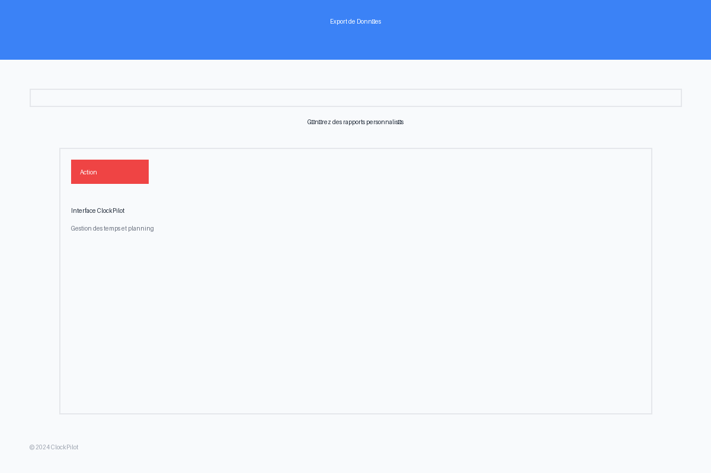

# ClockPilot - Guide Utilisateur

Guide complet d'utilisation de ClockPilot, la solution de gestion des temps et planning d'équipe.

## Table des matières

1. [Connexion](#connexion)
2. [Interface Employé](#interface-employé)
3. [Interface Administrateur](#interface-administrateur)
4. [Fonctionnalités Avancées](#fonctionnalités-avancées)
5. [FAQ](#faq)

---

## Connexion

### Page de connexion

La page de connexion vous permet d'accéder à ClockPilot avec vos identifiants.

**Éléments principaux :**
1. **Champ email** - Saisissez votre adresse email professionnelle
2. **Champ mot de passe** - Votre mot de passe sécurisé
3. **Case "Se souvenir de moi"** - Pour rester connecté sur cet appareil
4. **Bouton "Se connecter"** - Lance la connexion
5. **Lien mot de passe oublié** - Réinitialisation par email

### Gestion des erreurs

En cas d'identifiants incorrects, un message d'erreur explicite s'affiche pour vous guider.

### Redirection après connexion

Après connexion réussie, vous êtes automatiquement redirigé vers votre tableau de bord selon votre rôle (employé ou administrateur).

---

## Interface Employé

### Tableau de bord

Le tableau de bord employé offre une vue d'ensemble de votre activité.

**Sections principales :**
1. **Résumé du jour** - Heures pointées, pause, heures restantes
2. **Planning de la semaine** - Vos créneaux programmés
3. **Activité récente** - Dernières actions effectuées
4. **Notifications** - Alertes et messages importants
5. **Accès rapides** - Boutons vers les fonctions principales

### Planning mensuel

La vue planning mensuel vous permet de consulter votre planning sur un mois complet.

**Fonctionnalités :**
1. **Navigation mensuelle** - Flèches pour changer de mois
2. **Vue calendrier** - Visualisation claire des créneaux
3. **Codes couleur** - Différenciation par type d'activité
4. **Détails au survol** - Informations complètes sur chaque créneau
5. **Légende** - Explication des couleurs et symboles

### Pointage temps réel

L'interface de pointage vous permet d'enregistrer vos heures de travail en temps réel.

**Éléments clés :**
1. **Horloge en temps réel** - Affichage de l'heure actuelle
2. **Statut actuel** - Indique si vous êtes pointé ou non
3. **Bouton pointage** - Action principale (entrée/sortie)
4. **Historique du jour** - Liste des pointages effectués
5. **Temps total** - Cumul des heures travaillées
6. **Indicateur géolocalisation** - Validation du lieu de travail

#### Processus de pointage

*Animation montrant le processus complet de pointage entrée et sortie*

### Saisie manuelle d'heures

Le formulaire de saisie manuelle permet d'ajouter des heures a posteriori.

**Champs obligatoires :**
1. **Date** - Jour concerné par la saisie
2. **Heure début** - Heure de début de l'activité
3. **Heure fin** - Heure de fin de l'activité
4. **Projet** - Sélection du projet associé
5. **Description** - Détails de l'activité réalisée
6. **Type** - Catégorie d'activité (travail, formation, etc.)

**Validation automatique :**
- Vérification des chevauchements
- Contrôle des limites horaires
- Validation des créneaux de planning

### Rapports personnels

La page rapports présente vos statistiques de travail sous forme graphique.

**Graphiques disponibles :**
1. **Heures par semaine** - Évolution de votre temps de travail
2. **Répartition par projet** - Temps passé sur chaque projet
3. **Comparaison planning/réalisé** - Écarts entre planifié et réel
4. **Heures supplémentaires** - Suivi des dépassements
5. **Taux de présence** - Pourcentage d'assiduité

**Filtres :**
- Période (jour, semaine, mois, année)
- Projets spécifiques
- Type d'activité

### Profil utilisateur

La page profil vous permet de gérer vos informations personnelles et préférences.

**Onglets disponibles :**
1. **Informations personnelles** - Nom, email, téléphone, adresse
2. **Photo de profil** - Upload et modification d'avatar
3. **Sécurité** - Changement mot de passe, 2FA
4. **Préférences** - Langue, notifications, format date/heure
5. **Sessions actives** - Gestion des connexions

---

## Interface Administrateur

### Tableau de bord administrateur

Le tableau de bord administrateur offre une vue d'ensemble de l'activité de l'entreprise.

**Métriques principales :**
1. **Employés connectés** - Nombre d'employés actuellement au travail
2. **Heures du jour** - Total des heures travaillées aujourd'hui
3. **Validations en attente** - Nombre d'heures à valider
4. **Alertes conformité** - Problèmes légaux détectés
5. **Projets actifs** - Nombre de projets en cours

### Gestion des employés

La page de gestion des employés permet de consulter et administrer l'équipe.

**Fonctionnalités :**
1. **Liste complète** - Tous les employés avec statut
2. **Filtres avancés** - Par département, statut, contrat
3. **Recherche** - Par nom, email, matricule
4. **Actions rapides** - Modifier, désactiver, voir détails
5. **Export** - Génération de listes Excel/PDF

#### Création d'employé

Le formulaire de création d'employé permet d'ajouter de nouveaux membres à l'équipe.

**Sections du formulaire :**
1. **Informations personnelles** - Nom, prénom, email
2. **Détails professionnels** - Poste, département, manager
3. **Contrat** - Type, dates, salaire, temps de travail
4. **Paramètres** - Permissions, groupes, planning type

### Workflow de validation

L'interface de validation permet d'approuver ou rejeter les heures saisies par les employés.

**Éléments de validation :**
1. **Liste des demandes** - Heures en attente de validation
2. **Détails employé** - Informations sur le demandeur
3. **Analyse automatique** - Alertes et recommandations
4. **Actions possibles** - Approuver, rejeter, demander modification
5. **Commentaires** - Zone pour justifier les décisions

#### Processus de validation

*Animation montrant le processus complet de validation des heures*

### Export et rapports

Le dialog d'export permet de générer des rapports personnalisés.

**Options d'export :**
1. **Format** - Excel, PDF, CSV
2. **Période** - Dates de début et fin
3. **Données** - Sélection des colonnes
4. **Filtres** - Employés, départements, projets
5. **Modèles** - Templates prédéfinis

#### Génération d'export

*Animation montrant la génération d'un export Excel avec barre de progression*

---

## Fonctionnalités Avancées

### Mode hors ligne

ClockPilot fonctionne même sans connexion internet grâce à son mode hors ligne intelligent.

**Capacités hors ligne :**
- Pointage en local avec synchronisation automatique
- Consultation des données en cache
- Saisie de formulaires avec queue de synchronisation
- Indicateurs visuels de statut de connexion

**Synchronisation automatique :**
- Détection du retour en ligne
- Upload automatique des actions en attente
- Résolution intelligente des conflits
- Notifications de réussite/échec

### Drag & Drop Planning

*Animation montrant la modification du planning par glisser-déposer*

Le planning peut être modifié intuitivement :
- Glisser-déposer pour déplacer des créneaux
- Redimensionnement pour ajuster la durée
- Copier-coller entre employés
- Validation automatique des contraintes

### Notifications temps réel

Le système de notifications WebSocket assure une information immédiate :
- Changements de planning
- Validation/rejet d'heures
- Alertes de conformité
- Messages administrateurs

### Conformité légale française

ClockPilot intègre les contraintes légales françaises :
- Respect des 35h hebdomadaires
- Gestion des heures supplémentaires
- Pauses obligatoires
- Repos compensateur
- Reporting légal automatique

---

## FAQ

### Questions fréquentes employés

**Q: Que faire si j'oublie de pointer ?**
R: Utilisez la saisie manuelle d'heures. Votre manager devra valider la saisie.

**Q: Puis-je modifier mes heures après validation ?**
R: Non, les heures validées sont verrouillées. Contactez votre manager pour toute correction.

**Q: Comment fonctionne le mode hors ligne ?**
R: Vos actions sont stockées localement et synchronisées automatiquement au retour de connexion.

**Q: Où voir mes heures supplémentaires ?**
R: Dans la section Rapports, onglet "Heures supplémentaires".

### Questions fréquentes administrateurs

**Q: Comment importer une liste d'employés ?**
R: Utilisez la fonction Import Excel dans la gestion des employés.

**Q: Peut-on personnaliser les rapports ?**
R: Oui, créez vos propres modèles dans la section Export.

**Q: Comment configurer les contraintes légales ?**
R: Paramètres → Conformité → Configuration légale française.

**Q: Les données sont-elles sauvegardées ?**
R: Oui, sauvegarde automatique quotidienne avec rétention de 30 jours.

### Support technique

**Email :** support@clockpilot.com  
**Téléphone :** +33 1 23 45 67 89  
**Horaires :** Lundi-Vendredi 9h-18h  

**Documentation technique :** [docs.clockpilot.com](https://docs.clockpilot.com)  
**Vidéos tutoriels :** [youtube.com/clockpilot](https://youtube.com/clockpilot)  

---

*Guide utilisateur ClockPilot v2.0 - Dernière mise à jour : Janvier 2024*